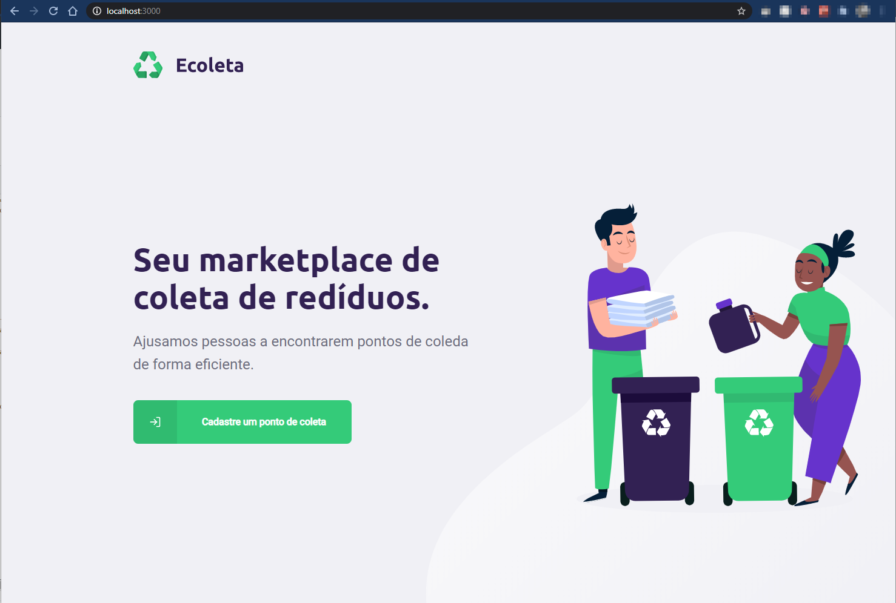
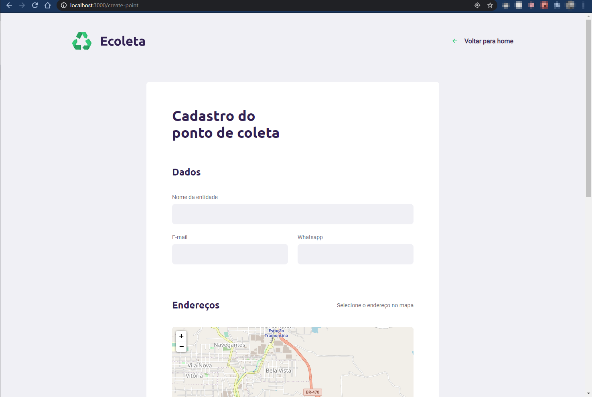
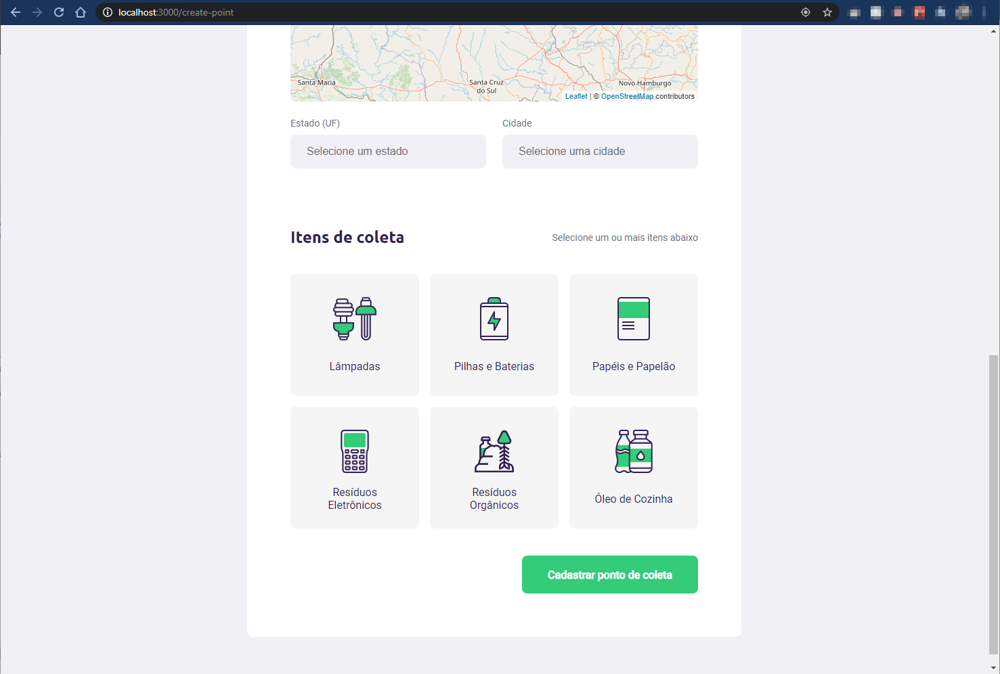

<h1 align="center">
    
</h1>

<h4 align="center"> 
	NextLevelWeek 1.0
</h4> 

Projeto desenvolvido durante a **NLW - Next Level Week** oferecida pela [Rocketseat][rs].
O NLW é uma experiência online com muito conteúdo prático, desafios e hacks onde o conteúdo fica disponível durante uma semana.

## 💻 O projeto

♻️ Ecoleta é um projeto para conectar empresas e entidades de coleta de resíduos orgânicos e inorgânicos, com as pessoas que precisam descartar seus resíduos de maneira ecológica.

As empresas ou entidades poderão se cadastrar na plataforma web enviando:
- uma imagem do ponto de coleta
- nome da entidade, email e whatsapp
- e o endereço para que ele possa aparecer no mapa
- além de selecionar um ou mais ítens de coleta: 
  - lâmpadas
  - pilhas e baterias
  - papéis e papelão
  - resíduos eletrônicos
  - resíduos orgânicos
  - óleo de cozinha

O projeto está dividio em duas partes:
1. Backend (pasta server) 
2. Frontend (pasta web)

## 🎨 Layout

O layout da aplicação está disponível no Figma:

### Mobile

A aplicação mobile não foi contemplada neste repositório.

### Web

  
  

    
    
  

## 🛠 Tecnologias

As seguintes ferramentas foram usadas na construção do projeto:

- [Node.js][nodejs]
- [React][reactjs]
- [TypeScript][typescript]

## 📝 Licença

Este projeto esta sobe a licença MIT.

[nodejs]: https://nodejs.org/
[typescript]: https://www.typescriptlang.org/
[expo]: https://expo.io/
[reactjs]: https://reactjs.org
[rn]: https://facebook.github.io/react-native/
[yarn]: https://yarnpkg.com/
[vscode]: https://code.visualstudio.com/
[vceditconfig]: https://marketplace.visualstudio.com/items?itemName=EditorConfig.EditorConfig
[license]: https://opensource.org/licenses/MIT
[vceslint]: https://marketplace.visualstudio.com/items?itemName=dbaeumer.vscode-eslint
[prettier]: https://marketplace.visualstudio.com/items?itemName=esbenp.prettier-vscode
[rs]: https://rocketseat.com.br
